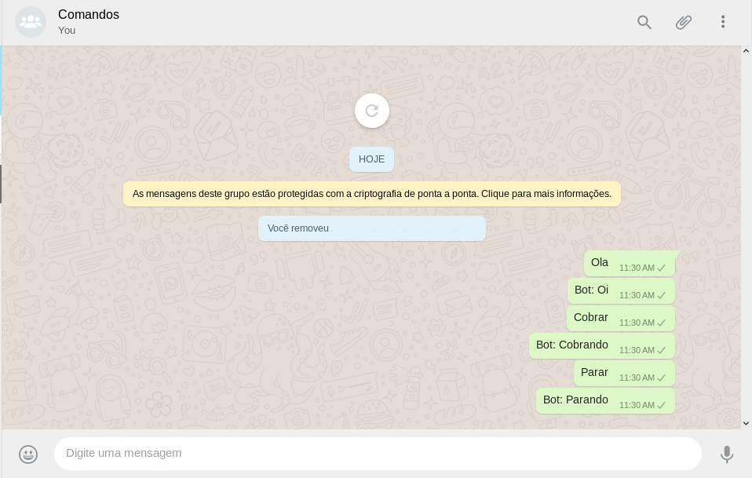

<h1>PayBot Whats'App</h1>

 Um bot de cobrança por whats'App 

<!-- Explica o Projeto -->
<h2> O que é o Projeto </h2>
  
 O PayBot Whats'App tem intuito inicial de extrair e tratar nomes do pdf do Banco Santander, pesquisá-lo nos contatos e enviar uma mensagem padrão.

<!-- Funcionalidades -->
<h2> Principais Funcionalidades </h2>
<!-- Nome -->
<h3> Busca de contatos </h3>
<!-- Explicação -->

 O comando find_contacts insere o nome passado no parametro e clica no contato.

<!-- Imagem -->

<!-- Nota -->

<b>Obs: se o contato nao for encontrado, ele retorna False</b>

<!-- Nome -->
<h3> Envio de Mensagens </h3>
<!-- Explicação -->

 O comando send_message envia a mensagem passada no parametro para o contato da tela atual.

<!-- Imagem -->

<!-- Nota -->

<b>Obs: É opcional escolher o contato, caso escolha ocorrerá a chamada de Busca de Contatos</b>

<!-- Nome -->
<h3> Cobrança </h3>
<!-- Explicação -->

 Comando Especial que lê o pdf de cobrança do Banco Santander, extrai os nomes, busca contatos com esses nomes e envia uma mensagem padrão

  
<!-- Nome -->
<h3> Grupo interpretador de comandos </h3>
<!-- Explicação -->

 Um grupo com nome padrao Comandos, no qual o bot interpreta a mensagem enviada pelo proprio contato. Exemplos de comandos na imagem abaixo:

<!-- Imagem -->

<!-- Nota -->

<b>Obs 1: Os comandos são definidos no arquivo commands.py .</b>

<b>Obs 2: Os comandos nao sao CaseSensitive</b>

<!-- Diario de Bordo -->
<h2> Diário de bordo</h2>
<!-- Dia -->
<h3> Dia 29/05/2019 </h3>
Neste dia eu fiz:
<!-- Açoes -->
<ul>
  <li>Implementação do Xpath no PO</li>
  <li>Atualização do PO</li>
</ul>
<!-- Dificuldades -->

Obtive algumas dificuldade na inserção do nome de contato na label de procura, tentei executar um comando javascript, porem com falhas,dessa forma utilizei um metodo do proprio selenium

<!-- Dia -->
<h3> Dia 30/05/2019 </h3>
Neste dia eu fiz:
<!-- Açoes -->
<ul>
  <li>Verificação e Criação de grupo de Comandos</li>
  <li>Grupo interpretador de comandos</li>
</ul>
<!-- Dificuldades -->

 A minha principal dificuldade hoje foi "scrollar" a scroll bar da area de dados do grupo, pois estava num div separado, e apos descobrir esse div, houveram falhas em encontrar via javascript, pois aparentemente o comando execute_script nao insere o JQuery, modo no qual tentava encontrar o elemento, porem encontrei a solução com o comando "document.querySelector"

